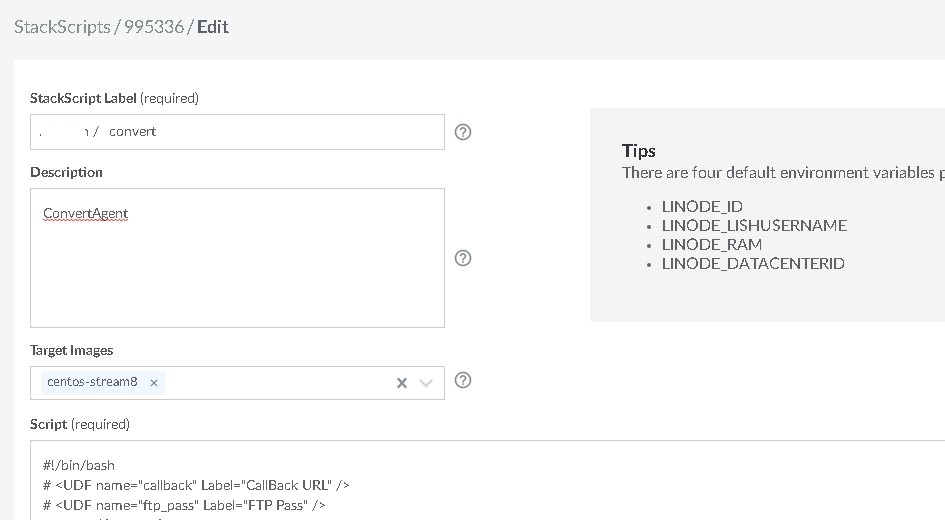
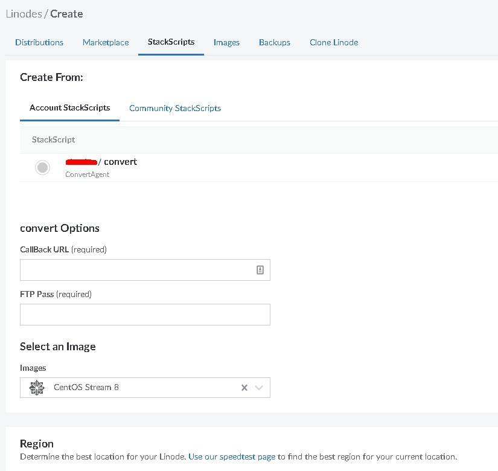

# KVS Convert Automation Deploy  

**automation KVS convert servers deploy**  

this tools can be automation deploy convert servers   

**why we need it?**  

    Cost , if all task complete, we can remove resource save cost.
    Speed , if we have lot task , can fast create more convert servers.


### Current Support  
  
 - Vultr  
 - Linode
 - Other....

### How to working?  

1. Create Instance by boot scripts  
2. Auto Install PHP FTP and more ......  
3. Callback Convert servers info to KVS System  

### How to using

#### Setup 1

change the line 6 Password in file `callback_api.php`  
upload it to you kvs path `/admin/api/callback_api.php`  

#### Setup 2

open init.sh by edit tools like editplus or noteplus++
change the line 6 ,7,and line 8

```shell
FTPPASS="FTpPas"  # You FTP Pass
APIURLS="https://yourdomains/admin/api/callback_api.php"; # if you use cloudflare or other include WAF ,please add it to whitelist
APIPASS="88888"; # this pass same of Setup 1 setting , callback auth using
```

Login Vultr , click the add startup script , url is https://my.vultr.com/startup/  
create the boot scripts like this


or Login Linode click the StackScripts , url is https://cloud.linode.com/stackscripts/account  
create the stackscript like this



copy init.sh content paste to script content and save  

#### Deploy

use vultr deploy  

    Type  =  Bare Metal Servers ( best performance )
    OS  = `CentOS 8 Stream`
    Startup scripts =  use setup 2 create


use linode deploy  

    click stackscript => deploy




if the instance image install complete......  
you will see it in KVS Admin like this  


yep, it's automate,you not need do anything   


### Idea
Many interesting features can be realized based on automated deployment  
like convert autoscale
    initial 5 convert servers
    if task over N , automated create N convert servers done quickly


